# Rehoboth Christian Church - Design System & User Flow Diagrams

## User Journey Flow

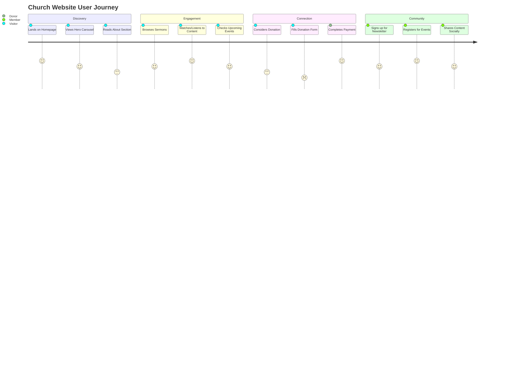

## Primary User Flow - Visitor to Donor Conversion

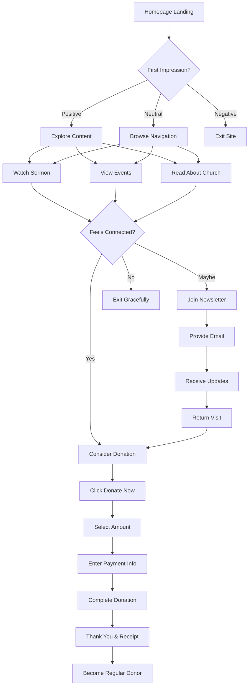

## Admin Content Management Flow

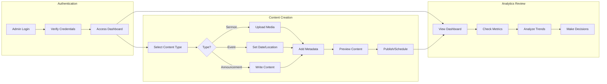

## Information Architecture

```mermaid
graph TD
    A[Homepage] --> B[About Us]
    A --> C[Sermons]
    A --> D[Events]
    A --> E[Ministries]
    A --> F[Contact]
    A --> G[Donate]
    
    B --> B1[Our Story]
    B --> B2[Leadership Team]
    B --> B3[Beliefs & Values]
    B --> B4[Location & Hours]
    
    C --> C1[Recent Sermons]
    C --> C2[Sermon Series]
    C --> C3[Browse by Speaker]
    C --> C4[Browse by Topic]
    
    D --> D1[Upcoming Events]
    D --> D2[Recurring Services]
    D --> D3[Special Events]
    D --> D4[Community Calendar]
    
    E --> E1[Children's Ministry]
    E --> E2[Youth Ministry]
    E --> E3[Adult Classes]
    E --> E4[Outreach Programs]
    
    F --> F1[Service Times]
    F --> F2[Get Directions]
    F --> F3[Contact Form]
    F --> F4[Staff Directory]
    
    G --> G1[One-time Donation]
    G --> G2[Recurring Giving]
    G --> G3[Designated Funds]
    G --> G4[Donor Portal]
```

## Design System Component Hierarchy

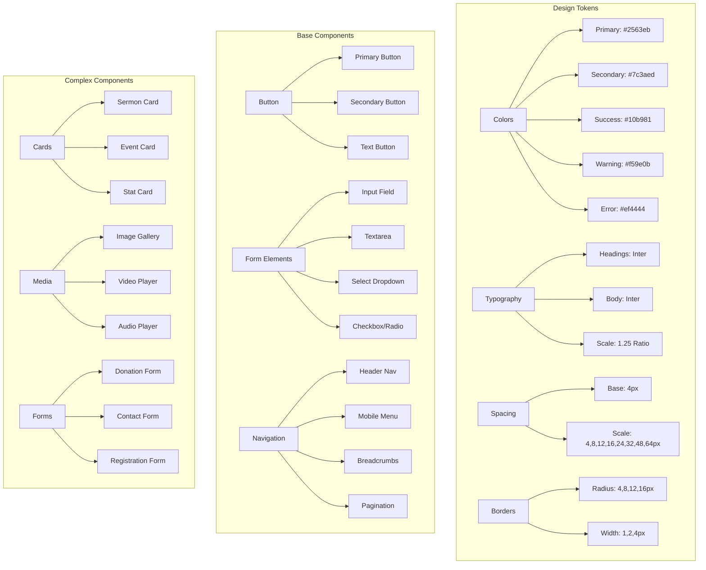

## Responsive Design Breakpoints

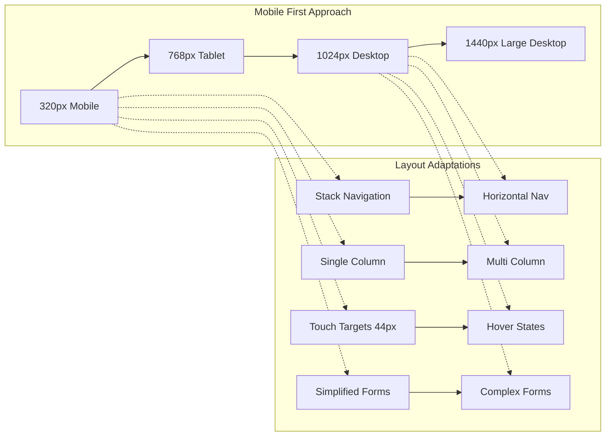

## Content Management System Architecture

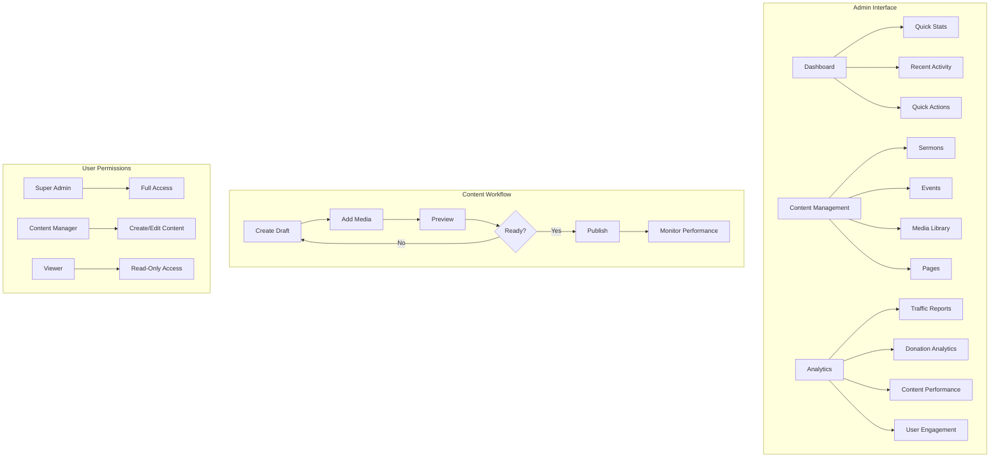

## Donation Flow State Machine

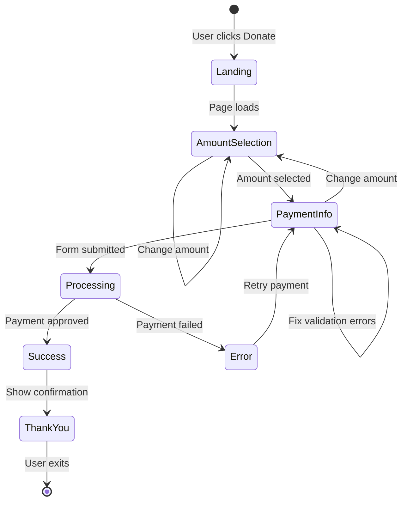

## Performance Optimization Strategy

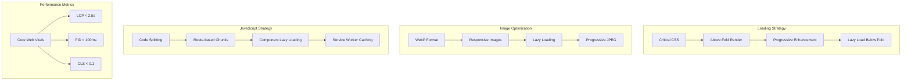

## Accessibility Implementation

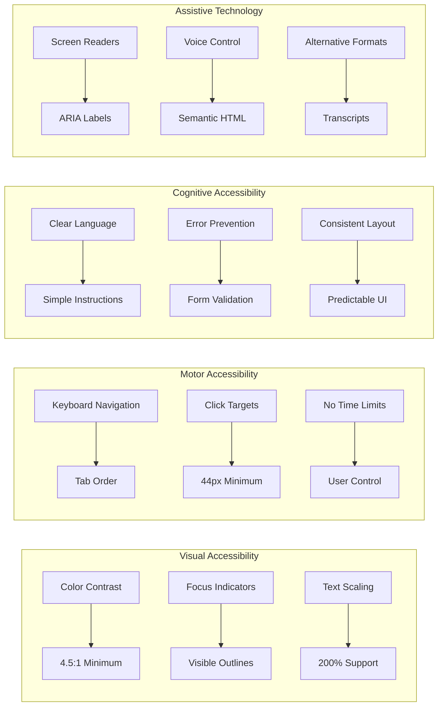

## Animation & Interaction Timeline

```mermaid
gantt
    title UI Animation Timing
    dateFormat X
    axisFormat %Ls
    
    section Page Load
    Logo Fade In           :0, 300
    Headline Slide Up      :300, 500
    Tagline Appear         :500, 700
    CTA Buttons Fade       :700, 900
    
    section Interactions
    Button Hover Scale     :0, 200
    Menu Open Slide        :0, 300
    Modal Backdrop Fade    :0, 200
    Form Validation Shake  :0, 400
    
    section Transitions
    Page Change Fade       :0, 500
    Carousel Auto-advance  :0, 1200
    Scroll Reveal Effects  :0, 600
```

## Error Handling & User Feedback

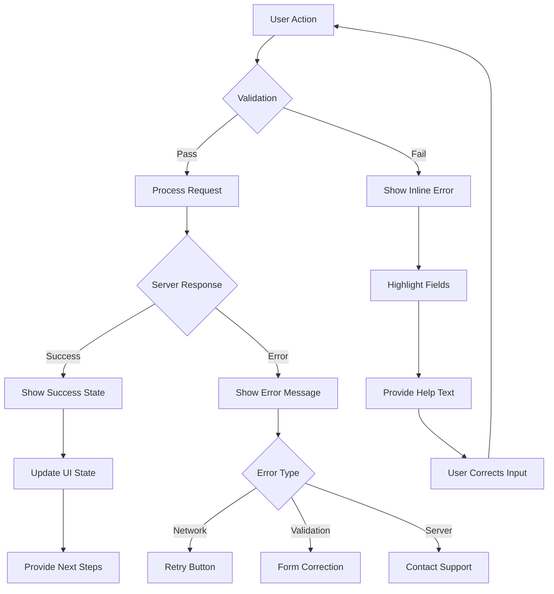

This comprehensive design system and user flow documentation provides the complete foundation for building a premium church website that balances spiritual mission with modern digital excellence.