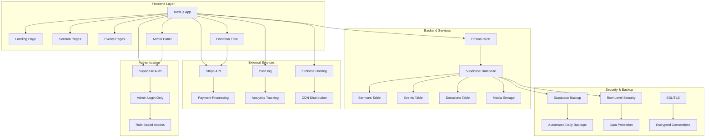
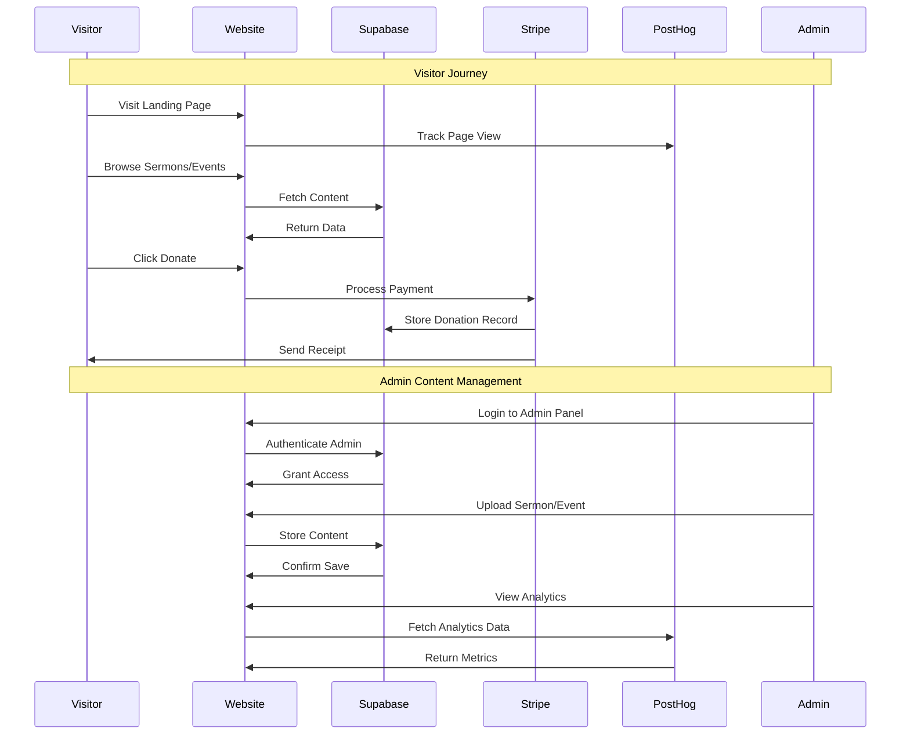
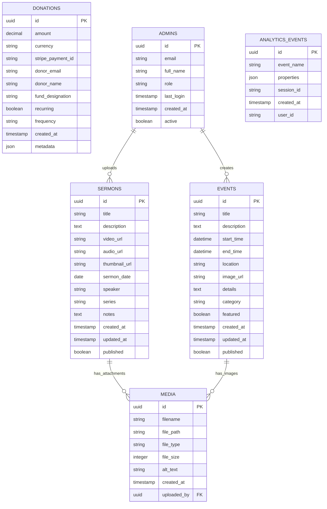
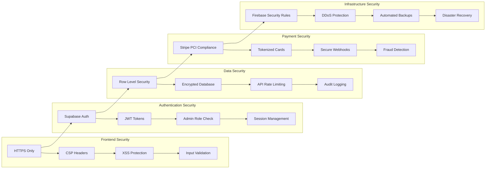
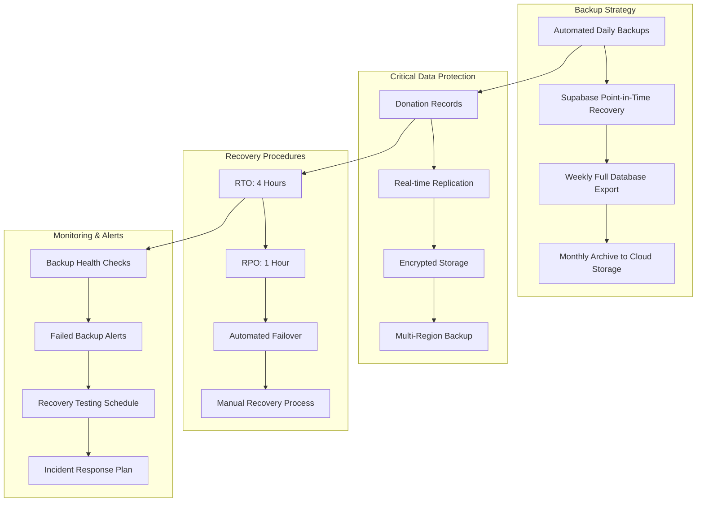
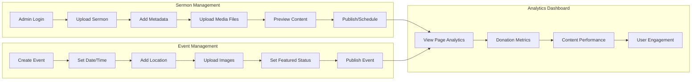
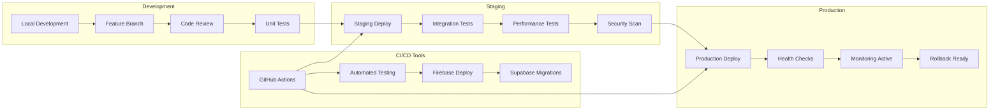
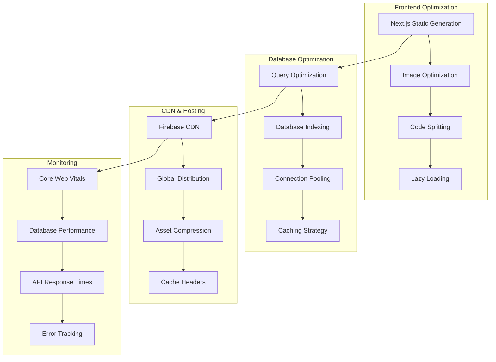
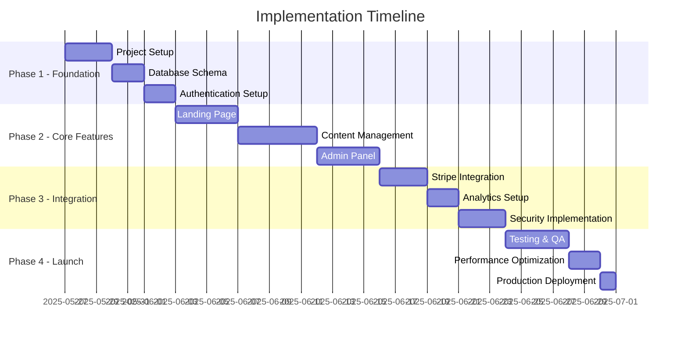
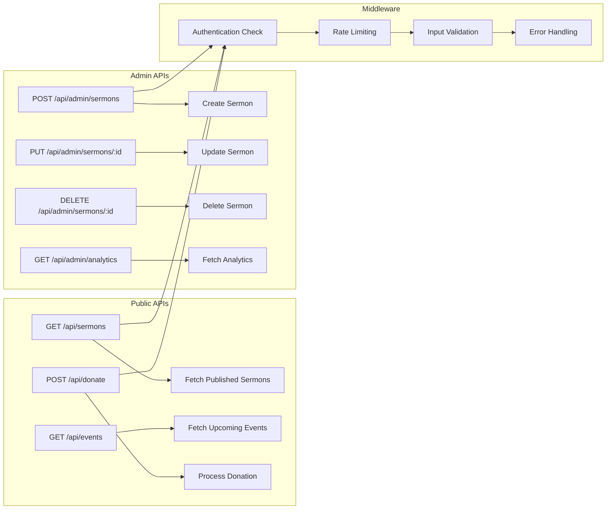

# Rehoboth Christian Church - Technical Architecture

## System Architecture Overview

## Data Flow Architecture

## Database Schema

## Security Architecture

## Backup & Disaster Recovery Plan

## Content Management Flow

## Deployment Pipeline

## Performance Optimization

## Implementation Phases

## API Architecture

