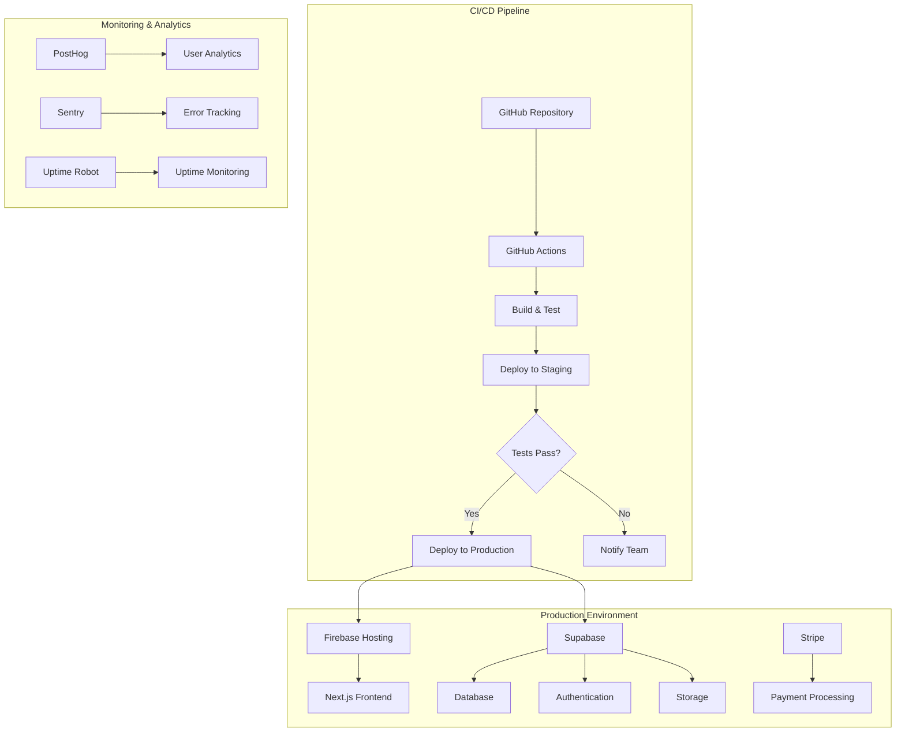

# Rehoboth Christian Church - Technical Specifications

## File System Structure
```
frontend/
├── public/
│   ├── index.html
│   ├── favicon.ico
│   └── assets/
│       ├── images/
│       ├── audio/
│       └── video/
├── src/
│   ├── components/
│   │   ├── common/
│   │   ├── hero/
│   │   ├── sermons/
│   │   ├── events/
│   │   ├── donations/
│   │   └── auth/
│   ├── pages/
│   ├── services/
│   ├── hooks/
│   ├── utils/
│   └── styles/
└── package.json

backend/
├── prisma/
│   └── schema.prisma
├── src/
│   ├── api/
│   ├── services/
│   ├── middleware/
│   ├── utils/
│   └── config/
├── migrations/
├── tests/
└── package.json
```

## Design System

### Design Tokens

**Colors:**
- Primary: #2563eb
- Secondary: #7c3aed
- Success: #10b981
- Warning: #f59e0b
- Error: #ef4444

**Typography:**
- Headings: Inter
- Body: Inter
- Scale: 1.25 Ratio

**Spacing:**
- Base: 4px
- Scale: 4, 8, 12, 16, 24, 32, 48, 64px

**Borders:**
- Radius: 4, 8, 12, 16px
- Width: 1, 2, 4px

### Responsive Design Breakpoints

- Mobile: 320px
- Tablet: 768px
- Desktop: 1024px
- Large Desktop: 1440px

---

## Feature 1: Hero Carousel System

### Goal
Implement a dynamic hero carousel that showcases church highlights, upcoming events, and key messages with smooth transitions and mobile responsiveness.

### API Relationships
- **GET /api/carousel/slides** - Fetch active carousel slides
- **POST/PUT/DELETE /api/admin/carousel** - Admin CRUD operations

### Architecture Overview
**Tech Stack:**
- Frontend: Next.js + TypeScript + Tailwind CSS
- Backend: Supabase + Prisma ORM
- Database: Supabase PostgreSQL
- Media Storage: Firebase Storage + CDN
- State Management: React Query + Zustand
- Analytics: PostHog

**Deployment:**
- Frontend: Firebase Hosting
- Backend: Supabase
- Database: Supabase PostgreSQL
- Media: Firebase Storage with CDN

### Database Schema
```sql
-- Carousel slides table
CREATE TABLE carousel_slides (
  id UUID PRIMARY KEY DEFAULT gen_random_uuid(),
  title VARCHAR(255) NOT NULL,
  subtitle TEXT,
  image_url VARCHAR(500) NOT NULL,
  cta_text VARCHAR(100),
  cta_link VARCHAR(500),
  display_order INTEGER NOT NULL DEFAULT 0,
  is_active BOOLEAN DEFAULT true,
  start_date TIMESTAMP,
  end_date TIMESTAMP,
  created_at TIMESTAMP DEFAULT NOW(),
  updated_at TIMESTAMP DEFAULT NOW()
);

-- Indexes
CREATE INDEX idx_carousel_active_order ON carousel_slides (is_active, display_order);
CREATE INDEX idx_carousel_dates ON carousel_slides (start_date, end_date);
```

### API Design

**GET /api/carousel/slides**
```typescript
// Response
{
  "data": [
    {
      "id": "uuid",
      "title": "Welcome to Rehoboth Church",
      "subtitle": "Join us for Sunday worship",
      "imageUrl": "https://firebasestorage.googleapis.com/hero1.jpg",
      "ctaText": "Learn More",
      "ctaLink": "/about",
      "displayOrder": 1
    }
  ],
  "meta": {
    "total": 3,
    "cached": true
  }
}
```

**Error Responses:**
- 500: Internal server error
- 429: Rate limit exceeded (100 req/min per IP)

### Frontend Component Structure
```
HeroCarousel/
├── HeroCarousel.tsx (main container)
├── CarouselSlide.tsx (individual slide)
├── CarouselControls.tsx (nav dots, arrows)
├── CarouselIndicators.tsx (progress indicators)
└── hooks/
    └── useCarousel.ts (carousel logic)
```

### CRUD Operations

**Validation Rules:**
- Title: Required, 3-255 characters
- Image URL: Valid URL format, HTTPS only
- CTA Link: Valid URL or relative path
- Display Order: Positive integer
- Date Range: End date must be after start date

**Pagination:**
- Default: 10 slides per page for admin
- Public API: All active slides (cached)

### UX Flow
```
User lands on homepage
↓
Hero carousel auto-plays (5s intervals)
↓
User can interact with:
- Navigation dots
- Previous/Next arrows
- Touch/swipe gestures (mobile)
↓
Click CTA button → Navigate to linked page
```

### Implementation Guide

**Carousel Logic Pseudocode:**
```typescript
function useCarousel(slides: Slide[], autoPlayDelay = 5000) {
  const [currentIndex, setCurrentIndex] = useState(0)
  const [isPlaying, setIsPlaying] = useState(true)
  const [touchStart, setTouchStart] = useState(0)
  
  // Auto-play logic
  useEffect(() => {
    if (!isPlaying || slides.length <= 1) return
    
    const interval = setInterval(() => {
      setCurrentIndex(prev => (prev + 1) % slides.length)
    }, autoPlayDelay)
    
    return () => clearInterval(interval)
  }, [isPlaying, slides.length, autoPlayDelay])
  
  // Touch/swipe handling
  const handleTouchStart = (e) => {
    setTouchStart(e.touches[0].clientX)
    setIsPlaying(false)
  }
  
  const handleTouchEnd = (e) => {
    const touchEnd = e.changedTouches[0].clientX
    const diff = touchStart - touchEnd
    
    if (Math.abs(diff) > 50) {
      if (diff > 0) goToNext()
      else goToPrevious()
    }
    
    setIsPlaying(true)
  }
}
```

**Data Flow Steps:**
1. Component mounts → Fetch slides from API
2. Cache response in React Query (5min TTL)  
3. Initialize carousel with first slide
4. Start auto-play timer
5. User interaction → Pause auto-play
6. Resume auto-play after 3s of inactivity

**Key Edge Cases:**
- Single slide: Disable navigation, auto-play
- No slides: Show fallback message
- Image load failure: Show placeholder + retry
- Network timeout: Use stale cache data
- Rapid navigation: Debounce transitions

### Security
**Authentication:** Public endpoint (no auth required)
**Input Sanitization:** 
- XSS protection on title/subtitle rendering
- URL validation for CTA links
- Image URL allowlist for trusted domains

**OWASP Protections:**
- Rate limiting: 100 requests/minute per IP
- CORS: Restrict to church domain only
- CSP headers for image sources
- Row Level Security (RLS) via Supabase

### Testing Strategy

**Unit Tests:**
- Carousel hook logic
- Slide component rendering
- Touch gesture handling
- Auto-play functionality

**Integration Tests:**
- API endpoint responses
- Image loading scenarios
- Navigation state management

**E2E Tests:**
- Full carousel interaction flow
- Mobile touch gestures
- CTA button navigation
- Auto-play behavior

**Performance Tests:**
- Image loading optimization
- Transition smoothness (60fps target)
- Memory usage with long sessions

### Data Management

**Caching Strategy:**
- Supabase caching for API responses (5min TTL)
- Browser: Images (24hr cache)
- Firebase CDN: Static assets (1yr cache)

**Real-time Needs:**
- Admin updates → Invalidate cache immediately
- No real-time sync needed for public view

### Logging & Error Handling

**Structured Logging:**
```typescript
// Using PostHog to track events
posthog.capture('carousel_slide_viewed', {
  slideId: slide.id,
  userAgent: navigator.userAgent,
  timestamp: new Date().toISOString()
})
```

**Error Recovery:**
- Image load failure → Retry 3x with exponential backoff
- API failure → Use cached data + show warning
- Network issues → Graceful degradation to static content

**Monitoring Alerts:**
- Image load failure rate > 5%
- API response time > 2s
- Cache hit rate < 80%

---

## Feature 2: Sermon Management System

### Goal
Provide a comprehensive system for managing, categorizing, and streaming sermon content with search capabilities and engagement tracking.

### API Relationships
- **GET /api/sermons** - List sermons with filters/pagination
- **GET /api/sermons/:id** - Get single sermon details
- **POST /api/admin/sermons** - Create new sermon
- **PUT /api/admin/sermons/:id** - Update sermon
- **DELETE /api/admin/sermons/:id** - Soft delete sermon

### Architecture Overview
**Tech Stack:**
- Media Processing: FFmpeg for transcoding
- Firebase Storage for media files
- Streaming: HLS for adaptive streaming
- Analytics: PostHog event tracking

**Deployment:**
- Media Storage: Firebase Storage
- CDN: Firebase CDN
- Database: Supabase PostgreSQL

### Database Schema
```sql
-- Sermons table
CREATE TABLE sermons (
  id UUID PRIMARY KEY DEFAULT gen_random_uuid(),
  title VARCHAR(255) NOT NULL,
  description TEXT,
  scripture_reference VARCHAR(255),
  speaker_name VARCHAR(255) NOT NULL,
  sermon_date DATE NOT NULL,
  duration_seconds INTEGER,
  audio_url VARCHAR(500),
  video_url VARCHAR(500),
  thumbnail_url VARCHAR(500),
  transcript TEXT,
  tags TEXT[], -- PostgreSQL array
  series_id UUID REFERENCES sermon_series(id),
  view_count INTEGER DEFAULT 0,
  is_featured BOOLEAN DEFAULT false,
  is_published BOOLEAN DEFAULT false,
  created_at TIMESTAMP DEFAULT NOW(),
  updated_at TIMESTAMP DEFAULT NOW(),
  published BOOLEAN DEFAULT false
);

-- Sermon series table
CREATE TABLE sermon_series (
  id UUID PRIMARY KEY DEFAULT gen_random_uuid(),
  title VARCHAR(255) NOT NULL,
  description TEXT,
  image_url VARCHAR(500),
  start_date DATE,
  end_date DATE,
  is_active BOOLEAN DEFAULT true,
  created_at TIMESTAMP DEFAULT NOW()
);

-- Indexes
CREATE INDEX idx_sermons_published_date ON sermons (published, sermon_date DESC);
CREATE INDEX idx_sermons_series ON sermons (series_id);
CREATE INDEX idx_sermons_speaker ON sermons (speaker_name);
CREATE INDEX idx_sermons_tags ON sermons USING GIN (tags);
```

### API Design

**GET /api/sermons**
```typescript
// Query Parameters
{
  page?: number,
  limit?: number,
  speaker?: string,
  series?: string,
  tags?: string[],
  date_from?: string,
  date_to?: string,
  featured?: boolean,
  search?: string
}

// Response
{
  "data": [
    {
      "id": "uuid",
      "title": "Faith in Difficult Times",
      "description": "Finding hope when life gets hard",
      "scriptureReference": "Psalm 23:1-6",
      "speakerName": "Pastor John Smith",
      "sermonDate": "2024-01-15",
      "durationSeconds": 2400,
      "audioUrl": "https://firebasestorage.googleapis.com/sermons/audio/123.mp3",
      "videoUrl": "https://firebasestorage.googleapis.com/sermons/video/123.m3u8",
      "thumbnailUrl": "https://firebasestorage.googleapis.com/sermons/thumbs/123.jpg",
      "tags": ["faith", "hope", "psalms"],
      "series": {
        "id": "uuid",
        "title": "Walking with God"
      },
      "viewCount": 245,
      "isFeatured": true
    }
  ],
  "meta": {
    "total": 150,
    "page": 1,
    "limit": 12,
    "totalPages": 13
  }
}
```

### Frontend Component Structure
```
Sermons/
├── SermonList.tsx (main listing page)
├── SermonCard.tsx (individual sermon preview)
├── SermonDetail.tsx (full sermon page)
├── SermonPlayer.tsx (audio/video player)
├── SermonSearch.tsx (search interface)
├── SermonFilters.tsx (filter controls)
└── hooks/
    ├── useSermons.ts
    ├── useSermonPlayer.ts
    └── useSermonSearch.ts
```

### CRUD Operations

**Validation Rules:**
- Title: Required, 3-255 characters
- Speaker: Required, valid name format
- Sermon Date: Valid date, not future
- Duration: Positive integer seconds
- Media URLs: Valid format, HTTPS only
- Tags: Max 10 tags, 2-50 chars each

**Pagination:**
- Default: 12 sermons per page
- Max: 50 sermons per page
- Cursor-based for infinite scroll

**Soft Delete:**
- Update published flag to false
- Hide from public queries
- Admin can restore by setting published to true

### UX Flow
```
User visits sermons page
↓
Browse/filter sermon list
↓
Click sermon → Navigate to detail page
↓
Choose audio or video playback
↓
Player tracks progress + engagement
↓
Related sermons suggested at end
```

### Implementation Guide

**Search Logic Pseudocode:**
```typescript
async function searchSermons(query: string, filters: SearchFilters) {
  // Supabase full text search
  const { data, error } = await supabase
    .from('sermons')
    .select('*')
    .textSearch('title, description, transcript', query, {
      config: 'english',
      type: 'websearch'
    })
    .eq('published', true)
    .order('sermon_date', { ascending: false })
    .range(filters.offset, filters.offset + filters.limit - 1)
    
  if (error) {
    console.error('Search error:', error)
    return { data: [], totalCount: 0 }
  }
  
  // Get total count for pagination
  const { count } = await supabase
    .from('sermons')
    .select('*', { count: 'exact', head: true })
    .textSearch('title, description, transcript', query, {
      config: 'english',
      type: 'websearch'
    })
    .eq('published', true)
    
  return { data, totalCount: count }
}
```

**Player Progress Tracking:**
```typescript
function trackProgress(sermonId: string, currentTime: number, duration: number) {
  const completionPercentage = (currentTime / duration) * 100
  
  // Throttle updates to every 10 seconds
  if (lastUpdateTime + 10000 < Date.now()) {
    // Track with PostHog
    posthog.capture('sermon_progress', {
      sermonId,
      watchDuration: currentTime,
      completionPercentage: Math.round(completionPercentage)
    })
    lastUpdateTime = Date.now()
  }
}
```

**Key Edge Cases:**
- Media file not found: Show error + contact admin
- Slow network: Progressive loading + quality adjustment
- Incomplete uploads: Show processing status
- Concurrent edits: Optimistic locking with version control

### Security
**Authentication:** 
- Public: Read access to published sermons
- Admin: Full CRUD with role-based permissions via Supabase Auth

**Input Sanitization:**
- HTML sanitization for descriptions
- File type validation for uploads
- Size limits: Audio 100MB, Video 1GB

**Media Security:**
- Signed URLs for upload/access
- Download prevention via streaming only
- Firebase security rules for access control

### Testing Strategy

**Unit Tests:**
- Sermon model validation
- Search query building
- Player progress calculation
- File upload handling

**Integration Tests:**
- API endpoint responses
- Database queries with filters
- Media streaming functionality
- Search functionality

**Performance Tests:**
- Large sermon list loading
- Concurrent media streaming
- Search response times
- Database query optimization

### Data Management

**Caching Strategy:**
- API responses: 5min TTL
- Search results: 2min TTL  
- Media metadata: 1hr TTL
- View counts: Real-time updates

**Media Lifecycle:**
- Upload → Transcode → Store → CDN
- Auto-delete processing files after 7 days

### Logging & Error Handling

**Event Tracking:**
```typescript
// Using PostHog for analytics
posthog.capture('sermon_started', {
  sermonId: sermon.id,
  mediaType: 'video',
  userSession: sessionId
})

posthog.capture('sermon_completed', {
  sermonId: sermon.id,
  completionRate: 95,
  totalDuration: 2400
})
```

**Error Recovery:**
- Media streaming failures → Fallback to different CDN edge
- Search service down → Fall back to database query
- Upload failures → Resume from last chunk

---

## Feature 3: Event Management System

### Goal
Enable comprehensive event management with registration, calendar integration, capacity management, and automated communications.

### API Relationships
- **GET /api/events** - List upcoming events
- **GET /api/events/:id** - Get event details
- **POST /api/events/:id/register** - Register for event
- **DELETE /api/events/:id/register** - Cancel registration
- **GET /api/events/calendar** - Calendar feed (iCal format)
- **POST /api/admin/events** - Create event
- **PUT /api/admin/events/:id** - Update event

### Architecture Overview
**Tech Stack:**
- Calendar: iCal/CalDAV standards
- Email: SendGrid for notifications
- Maps: Google Maps API for location
- Payments: Stripe for paid events

**Real-time Features:**
- Supabase Realtime for live registration updates
- Push notifications for event reminders

### Database Schema
```sql
-- Events table
CREATE TABLE events (
  id UUID PRIMARY KEY DEFAULT gen_random_uuid(),
  title VARCHAR(255) NOT NULL,
  description TEXT,
  event_type VARCHAR(50) NOT NULL, -- 'service', 'study', 'social', 'outreach'
  start_datetime TIMESTAMP NOT NULL,
  end_datetime TIMESTAMP NOT NULL,
  location_name VARCHAR(255),
  location_address TEXT,
  location_coordinates POINT, -- PostGIS for geo data
  max_capacity INTEGER,
  registration_required BOOLEAN DEFAULT false,
  registration_deadline TIMESTAMP,
  cost_cents INTEGER DEFAULT 0,
  image_url VARCHAR(500),
  contact_email VARCHAR(255),
  contact_phone VARCHAR(20),
  is_featured BOOLEAN DEFAULT false,
  published BOOLEAN DEFAULT false,
  created_at TIMESTAMP DEFAULT NOW(),
  updated_at TIMESTAMP DEFAULT NOW(),
  category VARCHAR(100)
);

-- Event registrations
CREATE TABLE event_registrations (
  id UUID PRIMARY KEY DEFAULT gen_random_uuid(),
  event_id UUID NOT NULL REFERENCES events(id),
  attendee_name VARCHAR(255) NOT NULL,
  attendee_email VARCHAR(255) NOT NULL,
  attendee_phone VARCHAR(20),
  party_size INTEGER DEFAULT 1,
  special_requests TEXT,
  registration_status VARCHAR(20) DEFAULT 'confirmed', -- 'confirmed', 'waitlist', 'cancelled'
  payment_status VARCHAR(20) DEFAULT 'pending', -- 'pending', 'paid', 'refunded'
  payment_intent_id VARCHAR(255), -- Stripe payment intent
  registered_at TIMESTAMP DEFAULT NOW(),
  updated_at TIMESTAMP DEFAULT NOW()
);

-- Indexes
CREATE INDEX idx_events_datetime ON events (start_datetime, published);
CREATE INDEX idx_events_type ON events (event_type);
CREATE INDEX idx_events_featured ON events (is_featured, start_datetime);
CREATE INDEX idx_registrations_event ON event_registrations (event_id);
CREATE INDEX idx_registrations_email ON event_registrations (attendee_email);
```

### API Design

**GET /api/events**  
```typescript
// Query Parameters
{
  from_date?: string,
  to_date?: string,
  category?: string,
  type?: string,
  featured?: boolean,
  limit?: number,
  page?: number
}

// Response
{
  "data": [
    {
      "id": "uuid",
      "title": "Sunday Morning Service",
      "description": "Join us for worship and fellowship",
      "eventType": "service",
      "startDateTime": "2024-01-21T10:00:00Z",
      "endDateTime": "2024-01-21T11:30:00Z",
      "location": {
        "name": "Main Sanctuary",
        "address": "123 Church St, City, State 12345",
        "coordinates": [-122.4194, 37.7749]
      },
      "maxCapacity": 200,
      "registrationRequired": false,
      "currentRegistrations": 0,
      "costCents": 0,
      "imageUrl": "https://firebasestorage.googleapis.com/events/service.jpg",
      "categories": ["worship", "weekly"],
      "isFeatured": true
    }
  ],
  "meta": {
    "total": 25,
    "hasMore": true,
    "nextCursor": "uuid"
  }
}
```

**POST /api/events/:id/register**
```typescript
// Request
{
  "attendeeName": "John Doe",
  "attendeeEmail": "john@example.com",
  "attendeePhone": "+1234567890",
  "partySize": 2,
  "specialRequests": "Wheelchair accessible seating"
}

// Response
{
  "success": true,
  "registrationId": "uuid",
  "status": "confirmed", // or "waitlist"
  "confirmationCode": "ABC123",
  "paymentRequired": false
}
```

### Frontend Component Structure
```
Events/
├── EventList.tsx (main events listing)
├── EventCard.tsx (event preview card)
├── EventDetail.tsx (full event page)  
├── EventCalendar.tsx (calendar view)
├── RegistrationForm.tsx (registration modal)
├── EventFilters.tsx (category/type filters)
└── hooks/
    ├── useEvents.ts
    ├── useEventRegistration.ts
    └── useEventCalendar.ts
```

### CRUD Operations

**Validation Rules:**
- Title: Required, 3-255 characters
- Start/End DateTime: Valid dates, end after start
- Capacity: Positive integer if set
- Email: Valid email format
- Phone: Valid phone format with country code
- Cost: Non-negative integer (cents)

**Registration Logic:**
- Check capacity before allowing registration
- Auto-waitlist when at capacity
- Send confirmation email immediately
- Handle payment processing for paid events

### UX Flow
```
User browses events list/calendar
↓
Filters by category/date/type
↓
Clicks event → View details page
↓
Clicks "Register" → Registration modal
↓
Fills form → Submits registration
↓
Payment processing (if required)
↓
Confirmation page + email sent
↓
Calendar integration offered
```

### Implementation Guide

**Registration Process Pseudocode:**
```typescript
async function registerForEvent(eventId: string, registration: RegistrationData) {
  // 1. Validate event exists and registration is open
  const { data: event } = await supabase
    .from('events')
    .select('*')
    .eq('id', eventId)
    .single()
    
  if (!event) throw new Error('Event not found')
  if (!event.registration_required) throw new Error('Registration not required')
  if (event.registration_deadline < new Date()) throw new Error('Registration closed')
  
  // 2. Check capacity
  const { count } = await supabase
    .from('event_registrations')
    .select('*', { count: 'exact', head: true })
    .eq('event_id', eventId)
    .neq('registration_status', 'cancelled')
  
  const currentCount = count || 0
  const status = (currentCount + registration.partySize) <= event.max_capacity 
    ? 'confirmed' 
    : 'waitlist'
  
  // 3. Create registration record
  const { data: newRegistration, error } = await supabase
    .from('event_registrations')
    .insert({
      event_id: eventId,
      attendee_name: registration.attendeeName,
      attendee_email: registration.attendeeEmail,
      attendee_phone: registration.attendeePhone,
      party_size: registration.partySize,
      special_requests: registration.specialRequests,
      registration_status: status,
      confirmation_code: generateConfirmationCode()
    })
    .select()
    .single()
  
  if (error) throw new Error('Failed to register')
  
  // 4. Process payment if required
  if (event.cost_cents > 0) {
    // Create Stripe payment
    // Similar to donation flow with Stripe
  }
  
  // 5. Send confirmation email
  await sendConfirmationEmail(newRegistration, event)
  
  return newRegistration
}
```

**Calendar Integration:**
```typescript
function generateICalFeed(events: Event[]) {
  const ical = `BEGIN:VCALENDAR
VERSION:2.0
PRODID:-//Rehoboth Church//Event Calendar//EN
CALSCALE:GREGORIAN
METHOD:PUBLISH
${events.map(event => `
BEGIN:VEVENT
UID:${event.id}@rehoboth-church.org
DTSTART:${formatICalDate(event.startDateTime)}
DTEND:${formatICalDate(event.endDateTime)}
SUMMARY:${event.title}
DESCRIPTION:${event.description}
LOCATION:${event.location.name}, ${event.location.address}
URL:https://rehoboth-church.org/events/${event.id}
END:VEVENT`).join('')}
END:VCALENDAR`
  
  return ical
}
```

**Key Edge Cases:**
- Simultaneous registrations hitting capacity limit
- Registration cancellations promoting waitlist
- Event updates after registrations exist
- Payment failures requiring registration cleanup
- Email delivery failures requiring retry mechanism

### Security
**Authentication:**
- Public: View published events
- Registered users: Manage own registrations  
- Admin: Full event management via Supabase RLS

**Data Protection:**
- Row Level Security for attendee information
- GDPR compliance for data deletion
- Rate limiting on registration endpoints

**Payment Security:**
- PCI compliance via Stripe integration
- No storage of payment card data
- Webhook signature verification

### Testing Strategy

**Unit Tests:**
- Registration validation logic
- Capacity management algorithms
- Calendar feed generation
- Payment processing workflows

**Integration Tests:**
- Full registration flow end-to-end
- Email notification delivery
- Payment webhook handling
- Calendar feed consumption

**Load Tests:**
- Concurrent registration scenarios
- High-traffic event launches
- Email delivery at scale

### Data Management

**Caching Strategy:**
- Event lists: 5min TTL with instant invalidation
- Registration counts: Real-time via Supabase Realtime
- Calendar feeds: 1hr TTL

**Data Retention:**
- Active registrations: Indefinite
- Cancelled registrations: 1 year
- Past events: Archive after 2 years

### Logging & Error Handling

**Event Tracking:**
```typescript
// Using PostHog for analytics
posthog.capture('event_registered', {
  eventId: event.id,
  eventType: event.type,
  partySize: registration.partySize,
  registrationMethod: 'web'
})

posthog.capture('event_cancelled', {
  eventId: event.id,
  cancellationReason: 'user_requested',
  advanceNotice: calculateAdvanceNotice(event.startDateTime)
})
```

**Error Recovery:**
- Payment failures → Retry with exponential backoff
- Email failures → Queue for later delivery
- Capacity race conditions → Atomic database updates

---

## Feature 4: Donation Processing System

### Goal
Implement secure, user-friendly donation processing with multiple payment methods, recurring donations, and comprehensive financial reporting.

### API Relationships
- **POST /api/donations** - Process one-time donation
- **POST /api/donations/recurring** - Set up recurring donation
- **PUT /api/donations/recurring/:id** - Update recurring donation
- **DELETE /api/donations/recurring/:id** - Cancel recurring donation
- **POST /api/donations/webhooks/stripe** - Handle Stripe webhooks

### Architecture Overview
**Tech Stack:**
- Payments: Stripe for processing + webhooks
- Compliance: PCI DSS via Stripe
- Analytics: PostHog for donation metrics
- Receipts: PDF generation + email delivery

**Security Focus:**
- Zero storage of payment card data
- Supabase RLS for donor data protection
- Audit logging for all financial transactions

### Database Schema
```sql
-- Donations table
CREATE TABLE donations (
  id UUID PRIMARY KEY DEFAULT gen_random_uuid(),
  amount DECIMAL NOT NULL,
  currency VARCHAR(3) DEFAULT 'USD',
  stripe_payment_id VARCHAR(255),
  donor_email VARCHAR(255),
  donor_name VARCHAR(255),
  fund_designation VARCHAR(100),
  recurring BOOLEAN DEFAULT false,
  frequency VARCHAR(20),
  created_at TIMESTAMP DEFAULT NOW(),
  metadata JSONB
);

-- Donation designations/funds
CREATE TABLE donation_designations (
  id UUID PRIMARY KEY DEFAULT gen_random_uuid(),
  name VARCHAR(100) NOT NULL UNIQUE,
  description TEXT,
  target_amount_cents INTEGER,
  current_amount_cents INTEGER DEFAULT 0,
  is_active BOOLEAN DEFAULT true,
  display_order INTEGER DEFAULT 0,
  created_at TIMESTAMP DEFAULT NOW()
);

-- Indexes
CREATE INDEX idx_donations_date ON donations (created_at DESC);
CREATE INDEX idx_donations_email ON donations (donor_email);
CREATE INDEX idx_donations_payment_id ON donations (stripe_payment_id);
```

### API Design

**POST /api/donate**
```typescript
// Request
{
  "amount": 5000, // $50.00 in cents
  "designation": "general",
  "isAnonymous": false,
  "dedicationMessage": "In memory of John Smith",
  "donorInfo": {
    "email": "donor@example.com",
    "firstName": "Jane",
    "lastName": "Doe",
    "phone": "+1234567890"
  },
  "paymentMethodId": "pm_stripe_payment_method_id"
}

// Response
{
  "success": true,
  "donationId": "uuid",
  "paymentIntentId": "pi_stripe_payment_intent_id",
  "clientSecret": "pi_xxx_secret_xxx",
  "status": "requires_confirmation",
  "receiptNumber": "2024-001234"
}
```

**POST /api/donations/recurring**
```typescript
// Request
{
  "amount": 10000, // $100.00 monthly
  "frequency": "monthly",
  "designation": "missions",
  "startDate": "2024-02-01",
  "donorInfo": { /* same as above */ },
  "paymentMethodId": "pm_stripe_payment_method_id"
}

// Response  
{
  "success": true,
  "recurringDonationId": "uuid",
  "subscriptionId": "sub_stripe_subscription_id",
  "nextDonationDate": "2024-02-01",
  "status": "active"
}
```

### Frontend Component Structure
```
Donations/
├── DonationForm.tsx (main donation interface)
├── DonationAmountSelector.tsx (preset + custom amounts)
├── DonationDesignation.tsx (fund selection)
├── DonorInfoForm.tsx (contact information)
├── PaymentMethodForm.tsx (Stripe Elements integration)
├── RecurringOptions.tsx (frequency selection)
├── DonationSummary.tsx (review before submit)
└── hooks/
    ├── useDonationFlow.ts
    ├── useStripePayment.ts
    └── useDonationHistory.ts
```

### CRUD Operations

**Validation Rules:**
- Amount: Minimum $1.00, maximum $10,000 per transaction
- Email: Valid format, required for receipts
- Phone: Valid format with country code
- Designation: Must exist in active designations list
- Payment Method: Valid Stripe payment method ID

**Data Protection:**
- Row Level Security for donor PII
- Email obfuscation for public donation displays

### UX Flow
```
User clicks "Donate Now"
↓
Select donation type (one-time/recurring)
↓
Choose amount (preset buttons + custom)
↓
Select designation/fund
↓
Enter donor information
↓
Choose payment method
↓
Review donation summary
↓
Process payment via Stripe
↓
Show confirmation + receipt
↓
Send email receipt
```

### Implementation Guide

**Donation Processing Pseudocode:**
```typescript
async function processDonation(request: DonationRequest) {
  // 1. Validate and sanitize input
  const validatedData = validateDonationRequest(request)
  
  // 2. Create Stripe Customer if needed
  let stripeCustomerId = ''
  
  const { data: existingDonor } = await supabase
    .from('donations')
    .select('metadata->stripeCustomerId')
    .eq('donor_email', validatedData.donorInfo.email)
    .order('created_at', { ascending: false })
    .limit(1)
    .single()
    
  if (existingDonor?.metadata?.stripeCustomerId) {
    stripeCustomerId = existingDonor.metadata.stripeCustomerId
  } else {
    const customer = await stripe.customers.create({
      email: validatedData.donorInfo.email,
      name: `${validatedData.donorInfo.firstName} ${validatedData.donorInfo.lastName}`
    })
    stripeCustomerId = customer.id
  }
  
  // 3. Create Stripe Payment Intent
  const paymentIntent = await stripe.paymentIntents.create({
    amount: validatedData.amount,
    currency: 'usd',
    customer: stripeCustomerId,
    payment_method: validatedData.paymentMethodId,
    confirmation_method: 'manual',
    confirm: true,
    metadata: {
      designation: validatedData.designation
    }
  })
  
  // 4. Create donation record
  const { data: donation, error } = await supabase
    .from('donations')
    .insert({
      amount: validatedData.amount / 100, // Convert cents to dollars
      currency: 'USD',
      stripe_payment_id: paymentIntent.id,
      donor_email: validatedData.donorInfo.email,
      donor_name: `${validatedData.donorInfo.firstName} ${validatedData.donorInfo.lastName}`,
      fund_designation: validatedData.designation,
      recurring: false,
      metadata: {
        stripeCustomerId,
        isAnonymous: validatedData.isAnonymous,
        dedicationMessage: validatedData.dedicationMessage
      }
    })
    .select()
    .single()
    
  if (error) throw new Error('Failed to create donation record')
  
  // 5. Generate receipt number
  const receiptNumber = await generateReceiptNumber()
  
  // 6. Track donation event
  posthog.capture('donation_completed', {
    donationId: donation.id,
    amount: validatedData.amount,
    type: 'one-time',
    designation: validatedData.designation
  })
  
  return {
    donationId: donation.id,
    paymentIntentId: paymentIntent.id,
    clientSecret: paymentIntent.client_secret,
    status: paymentIntent.status,
    receiptNumber
  }
}
```

**Key Edge Cases:**
- Payment method failures during processing
- Duplicate donation submissions (idempotency)
- Webhook delivery failures requiring replay
- Donor information updates affecting tax receipts
- Refund processing and accounting implications

### Security

**PCI Compliance:**
- Zero storage of payment card data
- Stripe handles all sensitive payment information
- Use Stripe Elements for secure card collection

**Data Protection:**
- Supabase RLS policies for donor information
- TLS 1.3 for all data in transit
- GDPR/CCPA compliance for data deletion

**Fraud Prevention:**
- Rate limiting: 5 donations per IP per hour
- Velocity checks: Max $1000 per donor per day
- Geographic restrictions if needed
- Stripe Radar for fraud detection

### Testing Strategy

**Unit Tests:**
- Donation validation logic
- Receipt generation functions
- Tax calculation methods

**Integration Tests:**
- Full donation flow end-to-end
- Stripe webhook processing
- Email receipt delivery
- Recurring donation lifecycle

**Security Tests:**
- PCI compliance validation
- Supabase RLS policy testing
- SQL injection prevention
- XSS protection in forms

**Load Tests:**
- High-volume donation processing
- Concurrent payment processing
- Webhook handling at scale

### Data Management

**Backup Strategy:**
- Supabase automated daily backups
- 7-year retention for tax compliance
- Point-in-time recovery

**Financial Reconciliation:**
- Daily Stripe settlement matching
- Monthly financial reporting
- Annual tax receipt generation
- Audit trail maintenance

### Logging & Error Handling

**Financial Event Tracking:**
```typescript
// Using PostHog for analytics
posthog.capture('donation_initiated', {
  amount: donation.amount,
  designation: donation.fund_designation,
  paymentMethod: 'card'
})

posthog.capture('donation_completed', {
  processingTime: Date.now() - startTime,
  stripePaymentIntentId: paymentIntent.id
})
```

**Error Recovery:**
- Payment failures → Retry mechanism
- Webhook delivery failures → Manual replay functionality
- Receipt generation failures → Automated retry queue
- Database failures → Transaction rollback

---

## Feature 5: Newsletter & Communication System

### Goal
Implement comprehensive email marketing and communication system with segmentation, automation, and engagement tracking for church community outreach.

### API Relationships
- **POST /api/newsletter/subscribe** - Subscribe to newsletter
- **DELETE /api/newsletter/unsubscribe** - Unsubscribe from newsletter
- **PUT /api/newsletter/preferences** - Update subscription preferences
- **GET /api/newsletter/campaigns** - Get campaign statistics

### Architecture Overview
**Tech Stack:**
- Email Service: SendGrid for delivery + analytics
- Template Engine: Handlebars for dynamic content
- Segmentation: Custom audience builder
- Analytics: PostHog for open/click tracking

**Deployment:**
- Email Service: SendGrid
- Database: Supabase PostgreSQL
- API Endpoints: Supabase Edge Functions

**Compliance:**
- CAN-SPAM Act compliance
- GDPR/CCPA privacy protection
- Double opt-in verification
- Easy unsubscribe mechanism

### Database Schema
```sql
-- Newsletter subscribers
CREATE TABLE newsletter_subscribers (
  id UUID PRIMARY KEY DEFAULT gen_random_uuid(),
  email VARCHAR(255) NOT NULL UNIQUE,
  first_name VARCHAR(100),
  last_name VARCHAR(100),
  preferences JSONB DEFAULT '{}',
  status VARCHAR(20) DEFAULT 'pending', -- 'active', 'pending', 'unsubscribed'
  verification_token VARCHAR(255),
  verified_at TIMESTAMP,
  created_at TIMESTAMP DEFAULT NOW(),
  updated_at TIMESTAMP DEFAULT NOW()
);

-- Email campaigns
CREATE TABLE email_campaigns (
  id UUID PRIMARY KEY DEFAULT gen_random_uuid(),
  name VARCHAR(255) NOT NULL,
  subject VARCHAR(255) NOT NULL,
  preview_text VARCHAR(255),
  template_id VARCHAR(100),
  content JSONB,
  status VARCHAR(20) DEFAULT 'draft', -- 'draft', 'scheduled', 'sending', 'sent', 'canceled'
  scheduled_at TIMESTAMP,
  sent_at TIMESTAMP,
  created_by UUID REFERENCES admins(id),
  created_at TIMESTAMP DEFAULT NOW(),
  updated_at TIMESTAMP DEFAULT NOW()
);

-- Campaign statistics
CREATE TABLE campaign_stats (
  id UUID PRIMARY KEY DEFAULT gen_random_uuid(),
  campaign_id UUID REFERENCES email_campaigns(id),
  emails_sent INTEGER DEFAULT 0,
  opens INTEGER DEFAULT 0,
  unique_opens INTEGER DEFAULT 0,
  clicks INTEGER DEFAULT 0,
  unique_clicks INTEGER DEFAULT 0,
  unsubscribes INTEGER DEFAULT 0,
  bounces INTEGER DEFAULT 0,
  complaints INTEGER DEFAULT 0,
  updated_at TIMESTAMP DEFAULT NOW()
);

-- Indexes
CREATE INDEX idx_subscribers_email ON newsletter_subscribers (email);
CREATE INDEX idx_subscribers_status ON newsletter_subscribers (status);
CREATE INDEX idx_campaigns_status ON email_campaigns (status);
CREATE INDEX idx_campaigns_scheduled ON email_campaigns (scheduled_at);
```

### API Design

**POST /api/newsletter/subscribe**
```typescript
// Request
{
  "email": "user@example.com",
  "firstName": "John",
  "lastName": "Doe",
  "preferences": {
    "weekly": true,
    "events": true,
    "sermons": false
  }
}

// Response
{
  "success": true,
  "message": "Verification email sent",
  "subscriberId": "uuid"
}
```

**PUT /api/newsletter/preferences**
```typescript
// Request
{
  "email": "user@example.com",
  "token": "verification_token", // Required for unverified changes
  "preferences": {
    "weekly": false,
    "events": true,
    "sermons": true,
    "announcements": false
  }
}

// Response
{
  "success": true,
  "message": "Preferences updated",
  "preferences": {
    "weekly": false,
    "events": true,
    "sermons": true,
    "announcements": false
  }
}
```

### Frontend Component Structure
```
Newsletter/
├── SubscribeForm.tsx (newsletter signup form)
├── PreferencesForm.tsx (preference management)
├── VerificationPage.tsx (email verification)
├── UnsubscribePage.tsx (opt-out page)
└── hooks/
    └── useNewsletterSubscription.ts
```

### CRUD Operations

**Validation Rules:**
- Email: Valid format, required
- Name: Optional, 2-50 characters each
- Preferences: Valid JSON object
- Verification Token: Valid UUID format when provided

**Email Templates:**
- Welcome email with verification link
- Weekly newsletter with dynamic content
- Event notifications with calendar integration
- Sermon digests with media links

### Implementation Guide

**Subscriber Management Pseudocode:**
```typescript
async function subscribeToNewsletter(email: string, firstName?: string, lastName?: string) {
  // Generate verification token
  const verificationToken = generateRandomToken()
  
  // Add subscriber with pending status
  const { data, error } = await supabase
    .from('newsletter_subscribers')
    .insert({
      email: email.toLowerCase(),
      first_name: firstName,
      last_name: lastName,
      status: 'pending',
      verification_token: verificationToken
    })
    .select()
    .single()
    
  if (error) {
    // Handle uniqueness violation separately
    if (error.code === '23505') { // PostgreSQL unique_violation
      const { data: existingUser } = await supabase
        .from('newsletter_subscribers')
        .select('status, verified_at')
        .eq('email', email.toLowerCase())
        .single()
        
      if (existingUser?.status === 'unsubscribed') {
        // Resubscribe flow
        return await resubscribeUser(email)
      } else if (!existingUser?.verified_at) {
        // Resend verification
        return await resendVerification(email)
      } else {
        throw new Error('Email already subscribed')
      }
    }
    throw new Error('Failed to subscribe')
  }
  
  // Send verification email
  await sendVerificationEmail(email, verificationToken)
  
  // Track event
  posthog.capture('newsletter_subscription', {
    email,
    source: 'website'
  })
  
  return data
}
```

**Campaign Management:**
```typescript
async function scheduleCampaign(campaignId: string, scheduledTime: Date) {
  // Validate campaign exists and is in draft status
  const { data: campaign } = await supabase
    .from('email_campaigns')
    .select('*')
    .eq('id', campaignId)
    .single()
    
  if (!campaign) throw new Error('Campaign not found')
  if (campaign.status !== 'draft') throw new Error('Only draft campaigns can be scheduled')
  
  // Update campaign status
  const { data, error } = await supabase
    .from('email_campaigns')
    .update({
      status: 'scheduled',
      scheduled_at: scheduledTime,
      updated_at: new Date()
    })
    .eq('id', campaignId)
    .select()
    .single()
    
  if (error) throw new Error('Failed to schedule campaign')
  
  // Schedule the actual delivery
  const delay = scheduledTime.getTime() - Date.now()
  if (delay <= 0) {
    // Send immediately if scheduled time is now or in the past
    await sendCampaign(campaignId)
  } else {
    // Schedule for future delivery
    setTimeout(() => sendCampaign(campaignId), delay)
  }
  
  return data
}
```

**Email Template Generation:**
```typescript
function generateNewsletterContent(campaign, subscriber) {
  // Load Handlebars template
  const template = Handlebars.compile(campaign.content.template)
  
  // Personalize content
  const personalizedContent = template({
    firstName: subscriber.first_name || 'Friend',
    unsubscribeUrl: `${process.env.BASE_URL}/unsubscribe?token=${subscriber.id}`,
    preferencesUrl: `${process.env.BASE_URL}/preferences?token=${subscriber.id}`,
    ...campaign.content.data
  })
  
  return {
    to: subscriber.email,
    from: 'newsletter@rehoboth-church.org',
    subject: campaign.subject,
    html: personalizedContent,
    trackingSettings: {
      clickTracking: { enable: true },
      openTracking: { enable: true }
    }
  }
}
```

**Key Edge Cases:**
- Bounced emails handling and cleanup
- Spam complaints automatic unsubscribe
- Template rendering errors with fallbacks
- Rate limiting for subscription attempts
- Handling of subscribers across segments

### Security
**Authentication:**
- Token-based validation for unsubscribes
- Admin authentication for campaign management
- IP-based rate limiting for subscription endpoints

**Data Protection:**
- Email addresses encrypted at rest
- PII compliance with data minimization
- Audit logs for all subscription changes
- GDPR data export/deletion capabilities

**Email Security:**
- SPF and DKIM records for email authentication
- DMARC policy implementation
- Regular security audits
- Sender reputation monitoring

### Testing Strategy

**Unit Tests:**
- Email validation logic
- Template rendering
- Token generation and validation
- Preference management logic

**Integration Tests:**
- Full subscription flow
- Email delivery testing
- Unsubscribe functionality
- Webhook handling for bounces

**Analytics Tests:**
- Open tracking accuracy
- Click tracking functionality
- Conversion attribution
- A/B testing methodology

### Data Management

**Data Segmentation:**
- Demographics-based segments
- Engagement-based segments (active/inactive)
- Interest-based segments
- Frequency preferences

**Performance Metrics:**
- Open rate benchmarking
- Click-through rates
- Conversion tracking
- List growth rate

### Logging & Error Handling

**Event Tracking:**
```typescript
// Using PostHog for analytics
posthog.capture('email_opened', {
  campaignId: campaign.id,
  subscriberId: subscriber.id,
  timestamp: new Date().toISOString(),
  device: getUserAgent()
})

posthog.capture('email_clicked', {
  campaignId: campaign.id,
  subscriberId: subscriber.id,
  linkUrl: clickedUrl,
  timestamp: new Date().toISOString()
})
```

**Error Recovery:**
- Failed delivery retry mechanism
- Template rendering fallbacks
- Automatic bounce handling
- Error alerting for high bounce rates
```

## Backup & Disaster Recovery Plan

### Backup Strategy
- Automated daily backups via Supabase
- Weekly full database exports stored in Firebase Storage
- Monthly archive to secure cloud storage with 1-year retention
- Point-in-time recovery capability with 30-day window

### Critical Data Protection
- Donation records with real-time replication to secondary region
- Encrypted storage for sensitive information (AES-256)
- Multi-region backup for critical data (us-east-1 primary, eu-west-1 secondary)
- Immutable backups for financial data

### Recovery Procedures
- RTO (Recovery Time Objective): 4 hours for critical systems
- RPO (Recovery Point Objective): 1 hour for all data
- Automated failover procedures for database services
- Documented manual recovery process with step-by-step guides
- Regular recovery drills (quarterly)

### Security Measures
- Regular penetration testing (quarterly)
- Access control audit logs
- Database backup encryption in transit and at rest
- Secure access to backup systems (MFA required)

### Monitoring & Alerts
- Real-time monitoring via Uptime Robot
- Regular backup health checks (daily automated tests)
- Failed backup alerts via email and SMS
- Recovery testing schedule with documented results
- Comprehensive incident response plan with assigned roles

## Deployment Architecture



## Implementation Timeline

### Phase 1 - Foundation (Week 1-2)
- Project repository setup with Next.js and TypeScript
- Database schema design and implementation in Supabase
- Authentication system setup with role-based access
- Development environment configuration
- CI/CD pipeline setup with GitHub Actions

### Phase 2 - Core Features (Weeks 3-4)
- Landing page implementation with Hero Carousel
- Sermon management system development
- Event system implementation
- Content management system for admin users
- Media storage integration with Firebase

### Phase 3 - Integration (Weeks 5-6)
- Stripe integration for donation processing
- PostHog analytics implementation
- Security hardening and penetration testing
- Error tracking with Sentry
- Performance optimization and load testing

### Phase 4 - User Experience & Testing (Week 7)
- Responsive design implementation and testing
- Accessibility compliance (WCAG 2.1 AA)
- Cross-browser testing
- User acceptance testing with church staff
- Content migration plan finalization

### Phase 5 - Launch & Monitoring (Week 8)
- Final QA and security audit
- Staging to production deployment
- DNS configuration and SSL setup
- Post-launch monitoring
- Documentation completion and handoff to church staff

### Phase 6 - Post-Launch Support (Weeks 9-12)
- Bug fixes and performance tuning
- User feedback collection and implementation
- Feature enhancement planning
- Staff training sessions
- Analytics review and optimization
